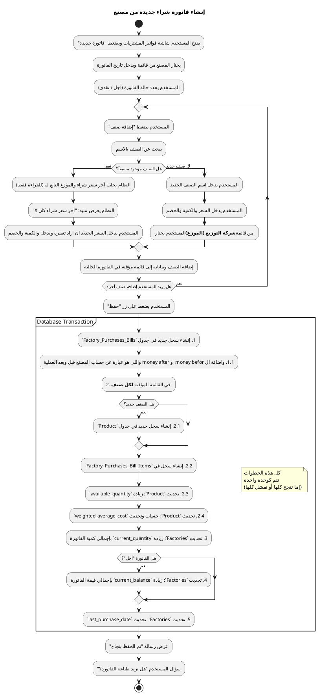
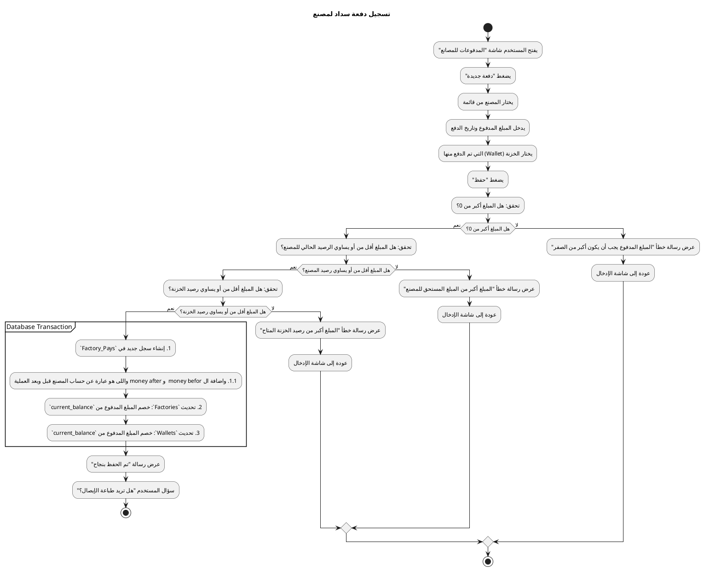
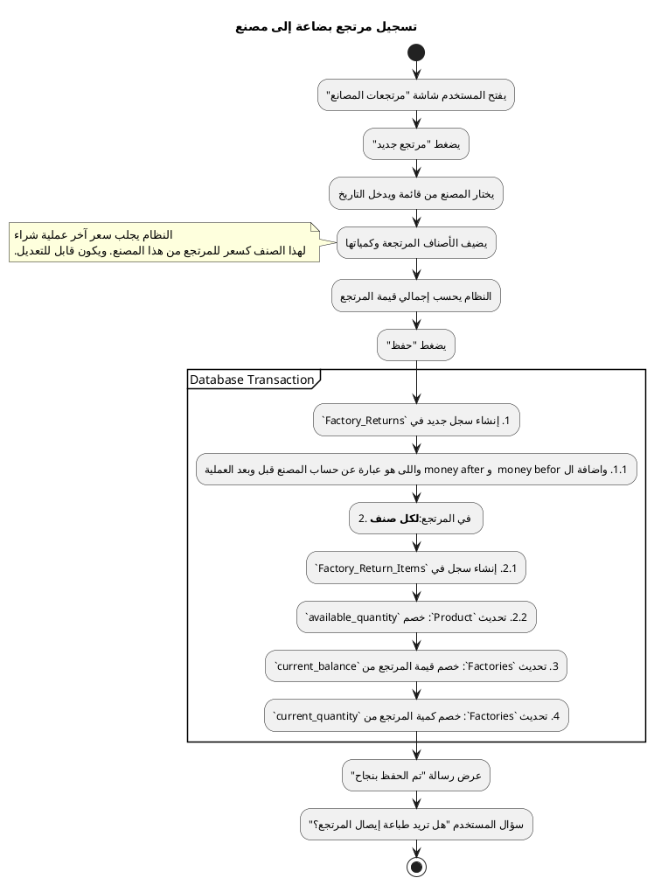
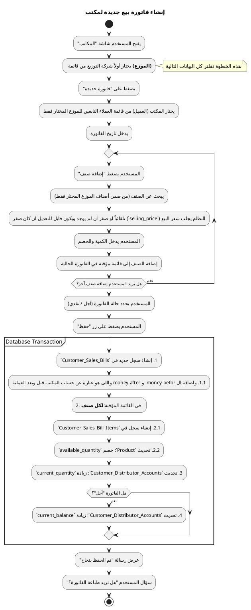
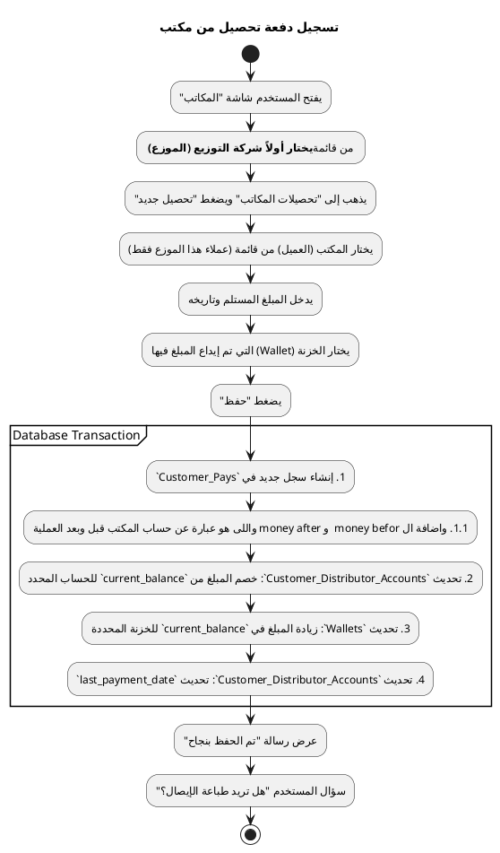
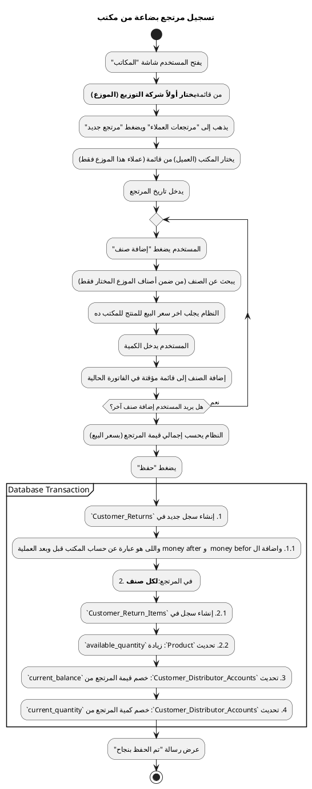

### كيفية استخدام هذا الكود:
يمكنك ببساطة نسخ كود كل عملية ولصقه في محرر PlantUML أونلاين (مثل `plantuml.com/plantuml`) لترى المخطط البياني فوراً.

---

### 1. إنشاء فاتورة شراء من مصنع
**الهدف:** توضيح الخطوات الكاملة لتسجيل فاتورة شراء، بما في ذلك التعامل مع الأصناف الجديدة والموجودة، وتحديث أرصدة المصنع والمخزون داخل Transaction واحدة لضمان دقة البيانات.

---

### 3. تسجيل دفعة سداد لمصنع
**الهدف:** عملية مالية بسيطة توضح كيف يتم تحديث رصيد المصنع ورصيد الخزنة معاً في Transaction واحدة.

---

### 3. تسجيل مرتجع بضاعة إلى مصنع
**الهدف:** توضيح عملية المرتجع التي تؤثر على ثلاثة أجزاء: رصيد المصنع المالي، إجمالي عدد القطع لديه، وكمية المنتج في المخزن.

---
### 4. إنشاء فاتورة بيع لمكتب
**الهدف:** توضيح سير العمل الخاص بالمبيعات، والذي يبدأ باختيار الموزع أولاً، ثم فلترة العملاء والمنتجات بناءً عليه، وتحديث حساب العميل المحدد مع هذا الموزع.

---

### 5. تسجيل دفعة تحصيل من مكتب
**الهدف:** توضح هذه العملية ضرورة تحديد الموزع ليتم الخصم من الحساب الصحيح للعميل، بالإضافة لتحديث رصيد الخزنة.

---

### 6. تسجيل مرتجع بضاعة من مكتب
**الهدف:** توضيح عملية مرتجع العميل التي تؤثر على حسابه لدى موزع معين، وتزيد من كمية المخزون.

