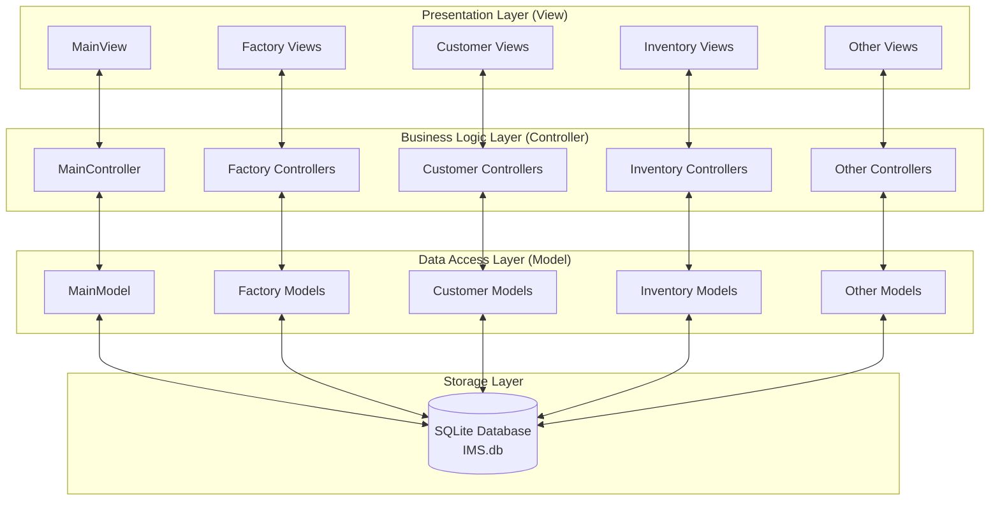
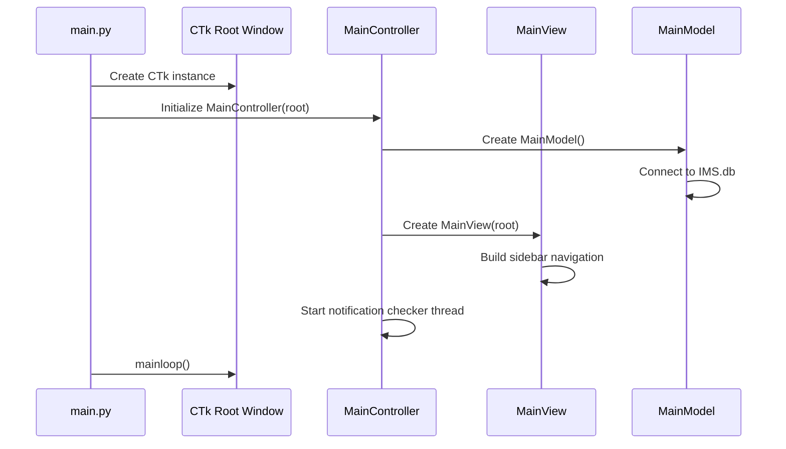
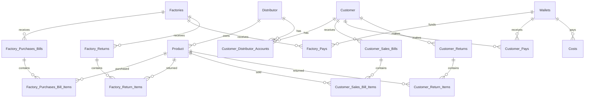
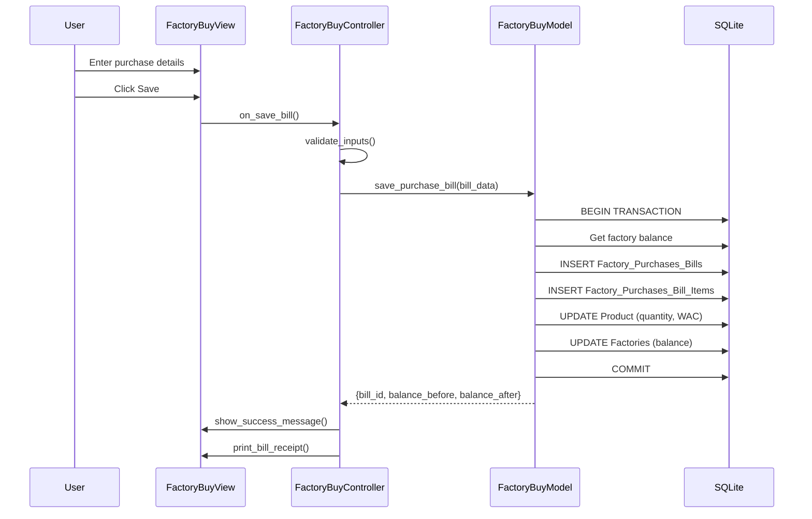
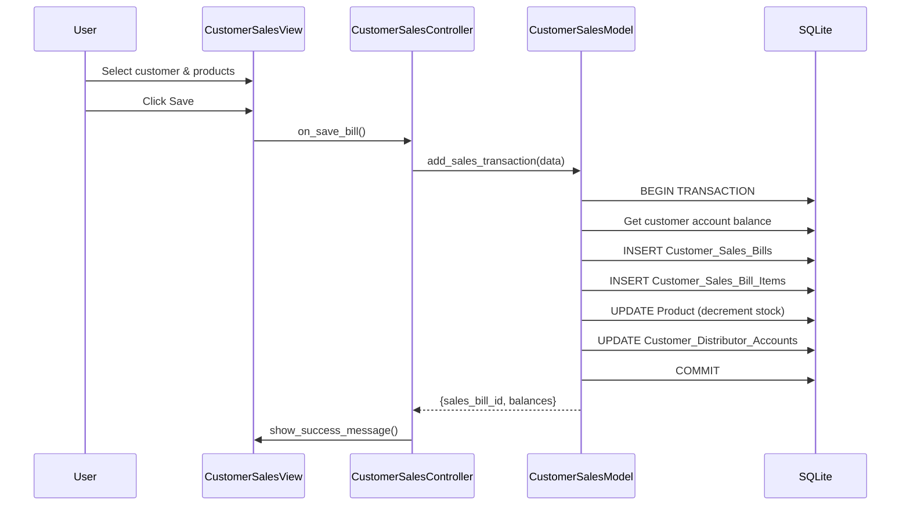

# System Architecture Documentation

## 1. Overview

The **Inventory Management System (IMS)** is a comprehensive desktop application designed for managing inventory, sales, purchases, and financial operations. Built with Python and CustomTkinter, the system follows the **Model-View-Controller (MVC)** architectural pattern to ensure separation of concerns and maintainability.

---

## 2. Technology Stack

| Component        | Technology                     |
| ---------------- | ------------------------------ |
| Language         | Python 3.x                     |
| GUI Framework    | CustomTkinter (modern Tkinter) |
| Database         | SQLite3 (`IMS.db`)             |
| Image Processing | Pillow (PIL)                   |
| Architecture     | Model-View-Controller (MVC)    |

---

## 3. High-Level Architecture



---

## 4. Directory Structure

```
src/
├── main.py                 # Application entry point
├── IMS.db                  # SQLite database file
├── Z_Files/                # Static assets (images, logos)
│
├── controller/             # Business logic layer
│   ├── main_controller.py
│   ├── distributor_controller.py
│   ├── wallet_controller.py
│   ├── extra_costs_controller.py
│   ├── notification_controller.py
│   ├── Customer/           # Customer module controllers
│   ├── Factory/            # Factory module controllers
│   └── Inventory/          # Inventory module controllers
│
├── model/                  # Data access layer
│   ├── main_model.py       # Database setup & core queries
│   ├── distributor_model.py
│   ├── wallet_model.py
│   ├── extra_costs_model.py
│   ├── notification_model.py
│   ├── Customer/           # Customer module models
│   ├── Factory/            # Factory module models
│   └── Inventory/          # Inventory module models
│
└── view/                   # Presentation layer
    ├── main_view.py
    ├── distributor_view.py
    ├── wallet_view.py
    ├── extra_costs_view.py
    ├── notification_view.py
    ├── Customer/           # Customer module views
    ├── Factory/            # Factory module views
    └── Inventory/          # Inventory module views
```

---

## 5. Module Architecture

### 5.1 Main Module

The entry point (`main.py`) initializes the application:



### 5.2 Factory Module

Manages factory purchases, payments, returns, and accounts.

| Controller                      | Model                      | View                      | Purpose                       |
| ------------------------------- | -------------------------- | ------------------------- | ----------------------------- |
| `factory_controller.py`         | -                          | `factory_view.py`         | Main factory navigation       |
| `factory_buy_controller.py`     | `factory_buy_model.py`     | `factory_buy_view.py`     | Purchase bills from factories |
| `factory_pay_controller.py`     | `factory_pay_model.py`     | `factory_pay_view.py`     | Payments to factories         |
| `factory_return_controller.py`  | `factory_return_model.py`  | `factory_return_view.py`  | Product returns to factories  |
| `factory_account_controller.py` | `factory_account_model.py` | `factory_account_view.py` | Factory account ledger        |
| `account_report_controller.py`  | `account_report_model.py`  | -                         | Account reports               |

### 5.3 Customer Module

Manages customer sales, payments, returns, and accounts per distributor.

| Controller                       | Model                       | View                       | Purpose                        |
| -------------------------------- | --------------------------- | -------------------------- | ------------------------------ |
| `customer_controller.py`         | -                           | `customer_view.py`         | Main customer navigation       |
| `customer_sales_controller.py`   | `customer_sales_model.py`   | `customer_sales_view.py`   | Sales bills to customers       |
| `customer_pay_controller.py`     | `customer_pay_model.py`     | `customer_pay_view.py`     | Payments from customers        |
| `customer_return_controller.py`  | `customer_return_model.py`  | `customer_return_view.py`  | Product returns from customers |
| `customer_account_controller.py` | `customer_account_model.py` | `customer_account_view.py` | Customer account ledger        |

### 5.4 Inventory Module

Tracks product stock and provides analytics dashboard.

| Controller                          | Model                          | View                          | Purpose                         |
| ----------------------------------- | ------------------------------ | ----------------------------- | ------------------------------- |
| `inventory_controller.py`           | `inventory_model.py`           | `inventory_view.py`           | Main inventory navigation       |
| `inventory_dashboard_controller.py` | `inventory_dashboard_model.py` | `inventory_dashboard_view.py` | Sales charts & profit analysis  |
| `inventory_details_controller.py`   | `inventory_details_model.py`   | `inventory_details_view.py`   | Product details per distributor |

### 5.5 Supporting Modules

| Module            | Purpose                                              |
| ----------------- | ---------------------------------------------------- |
| **Distributor**   | Manages distributor profiles (brands/product lines)  |
| **Wallet**        | Tracks cash flow and wallet balances                 |
| **Extra Costs**   | Records operational expenses                         |
| **Notifications** | Alerts for low stock, late payments, stale factories |

---

## 6. Database Schema



### Core Tables

| Table                           | Description                                 |
| ------------------------------- | ------------------------------------------- |
| `Distributor`                   | Brand/product line definitions              |
| `Product`                       | Products with weighted average cost & stock |
| `Factories`                     | Factory entities with balance tracking      |
| `Customer`                      | Customer entities                           |
| `Customer_Distributor_Accounts` | Per-distributor customer balances           |
| `Wallets`                       | Cash wallets for payments                   |

### Transaction Tables

| Table                          | Description                      |
| ------------------------------ | -------------------------------- |
| `Factory_Purchases_Bills`      | Purchase invoices from factories |
| `Factory_Purchases_Bill_Items` | Line items for purchase bills    |
| `Factory_Pays`                 | Payments made to factories       |
| `Factory_Returns`              | Products returned to factories   |
| `Customer_Sales_Bills`         | Sales invoices to customers      |
| `Customer_Sales_Bill_Items`    | Line items for sales bills       |
| `Customer_Pays`                | Payments received from customers |
| `Customer_Returns`             | Products returned by customers   |
| `Costs`                        | Additional operational expenses  |
| `Notifications`                | System alerts and notifications  |

---

## 7. Key Design Patterns

### 7.1 MVC Implementation

- **Model**: Handles database operations, business logic validation, and data transformation
- **View**: CustomTkinter frames for UI rendering; no direct database access
- **Controller**: Mediates between Model and View; handles user events and updates

### 7.2 Lazy Loading

Controllers use lazy imports to load sub-modules only when needed:

```python
def open_buy(self):
    from controller.Factory.factory_buy_controller import FactoryBuyController
    factory_buy = FactoryBuyController(self.view, self.db_conn)
```

### 7.3 Ledger Tracking

All transactions store `balance_before` and `balance_after` for audit trail:

```python
INSERT INTO Factory_Purchases_Bills (
    date, total_amount, is_paid,
    balance_before, balance_after,  -- Ledger fields
    factory_id
) VALUES (?, ?, ?, ?, ?, ?)
```

### 7.4 Thread-Safe Notifications

Background notification checking uses separate database connections:

```python
def generate_all_notifications(self):
    conn = sqlite3.connect(self.db_file)  # New connection for thread
    cursor = conn.cursor()
    # ... notification logic
    conn.close()
```

---

## 8. Data Flow Examples

### 8.1 Purchase from Factory



### 8.2 Sale to Customer



---

## 9. Security Considerations

- **Password Protection**: Sensitive areas (accounts, dashboard) require password verification
- **SQL Injection Prevention**: All queries use parameterized statements
- **Transaction Safety**: Database operations wrapped in transactions with rollback on failure
- **Thread Safety**: Separate database connections for background threads

---

## 10. Extensibility Points

| Extension Point       | Description                                                            |
| --------------------- | ---------------------------------------------------------------------- |
| New Distributor       | Add via Distributor module; products auto-categorize                   |
| New Report Type       | Add controller/view in respective module directory                     |
| New Notification Type | Add check method in `MainModel.generate_all_notifications()`           |
| UI Theming            | Modify `ctk.set_appearance_mode()` and `ctk.set_default_color_theme()` |
